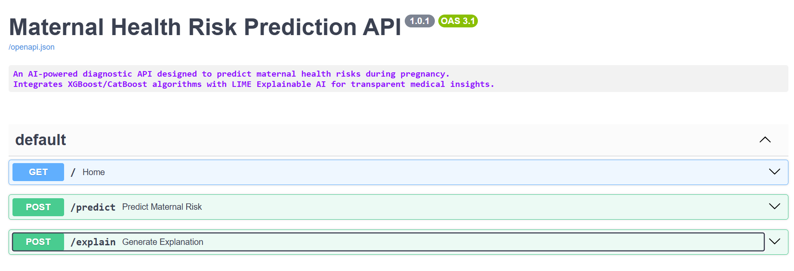
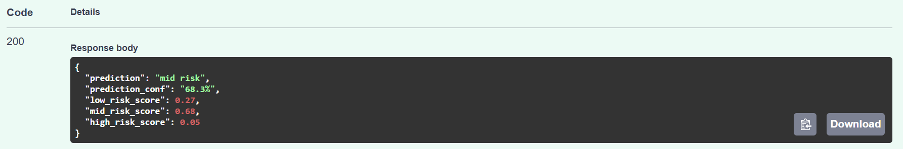
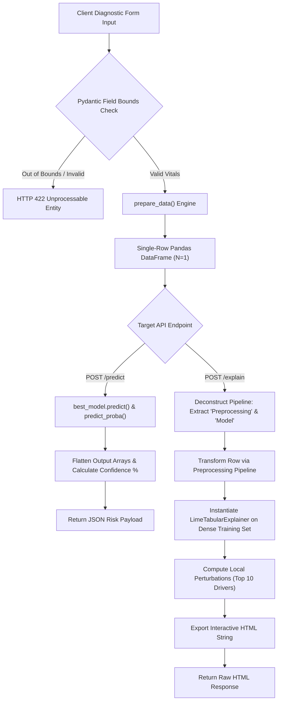

# Maternal Health Risk Prediction & Explainable AI (XAI) Microservice


---

## 📌 Overview

This project delivers a high-performance, production-grade microservice designed to predict maternal health risk levels and provide real-time, explainable diagnostic insights. Built on **FastAPI** and **Scikit-Learn**, the system encapsulates a tuned **CatBoost** Gradient Boosted Decision Tree (GBDT) pipeline that classifies patient vital signs into three clinical risk tiers: **Low Risk**, **Mid Risk**, and **High Risk**.

To eliminate the "black box" nature of machine learning in healthcare, the microservice incorporates **Local Interpretable Model-agnostic Explanations (LIME)** via a dedicated interpretability endpoint (`POST /explain`). This endpoint dynamically extracts model weights and constructs interactive HTML attributions for individual diagnostic parameters. Designed with clean architectural separation, strict Pydantic schema validation, and lifecycle memory optimization, this service bridges the gap between statistical computing and trustworthy clinical decision support systems.

> **📢 Runtime Environment Note**: This API is configured and validated for **local execution (`localhost`)**. All documented endpoints, Swagger UI workflows, and visual rendering components operate within local runtime environments to guarantee predictable memory allocation and zero-latency LIME perturbation calculations.

---

## 🎯 Context & Problem Statement

### 🏥 The Clinical Challenge
Maternal mortality and pregnancy-related complications represent critical public health challenges, particularly in low-resource and rural healthcare settings. While real-time monitoring of vital signs (such as blood pressure, glucose levels, and body temperature) enables early intervention, clinical facilities often lack specialized diagnostic tools or senior obstetric oversight on site.

### 🚫 The "Black Box" Barrier
Machine learning models offer strong capabilities for identifying subtle, multi-parameter health degradation. However, standard tree-based ensembles (e.g., CatBoost, XGBoost) function as opaque mathematical models. Healthcare professionals naturally hesitate to trust automated high-risk predictions without explicit feature attributions that explain *why* a patient is classified as high risk.

### 💡 Strategic Business & Operational Impact
1. **Clinical Interpretability & Trust**: By returning real-time visual feature attributions alongside risk class probabilities, the API empowers clinicians to cross-examine model logic against patient vitals (e.g., confirming if elevated systolic blood pressure or high blood glucose drove a high-risk score).
2. **Standardized Microservice Architecture**: Decouples complex machine learning inference routines from consumer user interfaces (web dashboards, mobile clinic apps), replacing unmaintainable diagnostic scripts with standard REST contracts.
3. **Upstream Data Integrity**: Enforces strict biological boundary checks at the API gateway layer using Pydantic, preventing corrupted diagnostic readings from reaching the estimator.

---

## 📊 Quantitative Metrics & Business Impact

The production classifier (`best_hp_model.joblib`) was trained and evaluated on a held-out test split of **91 patient records** derived from the UCI Maternal Health Risk Dataset (total $N=452$ records collected in rural Bangladesh).

### 📈 Global Classifier Performance

| Evaluation Metric | Score | Clinical & Engineering Significance |
| :--- | :--- | :--- |
| **Accuracy** | **71.00%** | Overall proportion of correct triage assignments across all 3 risk classes. |
| **Macro Precision** | **64.95%** | Unweighted precision across categories; accounts for conservative false-positive rates. |
| **Macro Recall** | **63.07%** | Sensitivity across risk levels; critical for capturing deteriorating vital signs. |
| **Macro F1-Score** | **63.13%** | Harmonic mean reflecting balanced multi-class diagnostic utility. |
| **Log Loss** | **0.659** | Well-calibrated probabilistic confidence distributions across risk categories. |
| **Test Set Size** | **91 Patients** | Strictly held-out test validation cohort. |

### 🔍 Per-Class Diagnostic Performance Analysis

```
===================================================================================
RISK TIER         PRECISION   RECALL   F1-SCORE   CLINICAL INTERPRETATION
===================================================================================
Low Risk          0.79        0.73     0.76       Strong boundary isolation for normal vitals.
Mid Risk          0.33        0.25     0.29       Moderate boundary overlap; flags for human review.
High Risk         0.83        0.92     0.87       High sensitivity; minimizes missed critical cases.
===================================================================================
```

* **High Risk Sensitivity ($F1 = 0.87$)**: The model achieves high recall ($0.92$) on high-risk maternal patients, minimizing false negatives where critical emergency intervention is needed.
* **Low Risk Accuracy ($F1 = 0.76$)**: Accurately filters out healthy patients, conserving clinical resources in overburdened facilities.
* **Mid-Risk Boundary Overlap ($F1 = 0.29$)**: Intermediate physiological vitals frequently overlap with mild high-risk or elevated low-risk baseline states, creating higher classification variance for this sub-cohort.

---

## 📷 Screenshots & Demo

### 1. Interactive Swagger UI API
  
*Standard OpenAPI/Swagger interface hosted at the service root, detailing operational routes, input parameters, and schema definitions.*

### 2. Risk Inference Payload Execution (`POST /predict`)
  
*Real-time diagnostic prediction output demonstrating calculated risk categories and percentage confidence distributions.*

### 3. Interactive Explainable AI Output (`POST /explain`)
  
*Dynamic LIME feature attribution output rendering positive (risk-increasing) and negative (risk-decreasing) clinical driver contributions.*

---

## ⚙️ Architecture & Data Preprocessing Flow

The application follows a clean layered architecture that separates the delivery framework (`app.py`) from the inference and XAI processing pipeline (`function.py`).

### 🧩 System Layer Responsibilities

#### 🌐 1. Delivery Layer (`app.py`)
* **Lifespan Context Manager**: Utilizes FastAPI's `@asynccontextmanager` to load heavy binary artifacts (`best_hp_model.joblib`, `lime_training_data.npy`, `feature_names.joblib`) into persistent memory (`app.state`) during server boot, avoiding disk I/O latency during request handling.
* **Input Validation Schema**: Enforces strict biological boundaries on input features using Pydantic's `BaseModel` and `Field` constraints.
* **HTTP Exception Handling**: Maps internal validation or model runtime exceptions directly to structured standard HTTP error codes (`400`, `422`, `500`).

#### 🔬 2. Inference & XAI Engine (`function.py`)
* **`prepare_data()`**: Formats scalar input parameters into a structured, single-row ($N=1$) Pandas DataFrame matching the exact schema expected by the Scikit-Learn transformer.
* **`predict()`**: Runs inputs through the model pipeline, flattens array dimensionality to prevent estimator output mismatches, and calculates floating-point confidence probabilities across all three risk classes.
* **`explain()`**: Safely extracts underlying pipeline components (`named_steps["Preprocessing"]` and `named_steps["Model"]`), transforms dense input feature matrices, and runs the `LimeTabularExplainer` to produce interactive HTML attributions.

### 🔄 End-to-End Data Flow Diagram


*Note: This architecture diagram is AI-generated using Mermaid.js. If you encounter rendering issues on certain platforms, minor manual syntax adjustments (e.g., escaping special characters or fixing subgraph IDs) may be required.*

### 🛡️ Feature Space & Validation Rules

| Clinical Feature | Pydantic Input Field | Type | Scale / Unit | Validation Constraint | Default Value |
| :--- | :--- | :--- | :--- | :--- | :--- |
| **Age** | `age` | `int` | Years | $10 \le x \le 70$ | `25` |
| **Systolic BP** | `systolic_bp` | `int` | mmHg | $70 \le x \le 160$ | `120` |
| **Diastolic BP** | `diastolic_bp` | `int` | mmHg | $49 \le x \le 100$ | `80` |
| **Blood Glucose** | `blood_glucose` | `float` | mmol/L | $6.0 \le x \le 19.0$ | `7.5` |
| **Body Temp** | `body_temp` | `float` | Fahrenheit (°F) | $98.0 \le x \le 103.0$ | `98.6` |
| **Heart Rate** | `heart_rate` | `int` | Beats / Min (bpm) | $60 \le x \le 90$ | `75` |

---

## 💻 Installation & Reproduction Steps

Follow these instructions to set up, run, and evaluate the microservice in a local development environment.

### 📋 Prerequisites
* **Python**: Version `3.10` or higher
* **Package Manager**: `pip` (Python Package Installer)
* **Virtual Environment**: `venv` or `conda`

### 🛠️ Step-by-Step Setup

#### 1. Clone the Repository
```bash
git clone https://github.com/viochris/Maternal-Health-Risk-API.git
cd Maternal-Health-Risk-API
```

#### 2. Create and Activate a Virtual Environment
```bash
# Linux/macOS
python3 -m venv venv
source venv/bin/activate

# Windows (PowerShell)
python -m venv venv
.\venv\Scripts\Activate.ps1
```

#### 3. Install Dependencies
```bash
pip install --upgrade pip
pip install -r requirements.txt
```

#### 4. Verify Local Assets Directory
Ensure the binary artifact directory exists and contains the necessary files:
```
Maternal-Health-Risk-Model/
├── best_hp_model.joblib
├── feature_names.joblib
└── lime_training_data.npy
```

#### 5. Launch the FastAPI Uvicorn Server
```bash
uvicorn app:app --host 127.0.0.1 --port 8000 --reload
```
The server will boot locally at `http://127.0.0.1:8000`. Access interactive API docs at `http://127.0.0.1:8000/docs`.

---

### 🧪 Execution & API Testing Verification

#### 🔹 1. Execute Risk Prediction (`POST /predict`)
```bash
curl -X 'POST' \
  'http://127.0.0.1:8000/predict' \
  -H 'accept: application/json' \
  -H 'Content-Type: application/x-www-form-urlencoded' \
  -d 'age=35&systolic_bp=140&diastolic_bp=90&blood_glucose=13.0&body_temp=98.0&heart_rate=70'
```

##### Example JSON Response:
```json
{
  "prediction": "high risk",
  "confidence": "88.42%",
  "probabilities": {
    "low_risk": 0.0215,
    "mid_risk": 0.0943,
    "high_risk": 0.8842
  }
}
```

#### 🔹 2. Generate Interpretability Visualization (`POST /explain`)
```bash
curl -X 'POST' \
  'http://127.0.0.1:8000/explain' \
  -H 'accept: text/html' \
  -H 'Content-Type: application/x-www-form-urlencoded' \
  -d 'age=35&systolic_bp=140&diastolic_bp=90&blood_glucose=13.0&body_temp=98.0&heart_rate=70' \
  --output explanation.html
```
*Open `explanation.html` in any web browser to view the interactive LIME visual feature contributions.*

---

## ⚠️ System Limitations & Future Work

To maintain technical transparency, system constraints are split into **Architectural Limitations** and **Runtime & Model Limitations**.

### 🏗️ Architectural Limitations

1. **Synchronous CPU-Bound XAI Execution**:
   Generating LIME explanations requires creating over 500 feature perturbations per request. The `explain()` function executes synchronously within Uvicorn's event loop, which can temporarily block concurrent HTTP requests during heavy explainability processing.
2. **URL-Encoded Form Data Payload Requirement**:
   API endpoints currently expect form-encoded body payloads (`application/x-www-form-urlencoded`) via `Annotated[ConditionalInput, Form()]`. This design requires clients to adapt payloads compared to standard `application/json` interfaces.
3. **Single-Instance ($N=1$) Processing Constraint**:
   The data preparation layer (`prepare_data()`) constructs single-row DataFrames (`index [0]`). The API does not natively accept array batches, requiring clients to issue sequential requests for multi-patient inferences.
4. **State-Bound Local Memory Dependencies**:
   Trained models and LIME background array buffers reside directly within the application state RAM (`app.state`). Horizontal scaling across multiple worker processes increases system memory consumption proportionally.

### 🧪 Runtime, Data & Model Limitations

1. **Local Development Runtime Environment**:
   The microservice is configured and tested for local execution (`localhost`). Deploying to persistent public server environments requires containerization setups (e.g., Docker) to manage background memory demands effectively.
2. **Dataset Size & Geographical Scope**:
   The underlying model was trained on 452 patient records collected from rural Bangladesh. Physiological baselines may vary across different geographical populations and demographic settings.
3. **Intermediate Risk Class Ambiguity**:
   The CatBoost classifier demonstrates reduced recall and precision for intermediate risk states ($F1 \approx 0.29$). Diagnostic outputs labeled as "Mid Risk" should be reviewed manually by medical staff.
4. **Lack of Enterprise Gateway Security Features**:
   The application operates with fully open Cross-Origin Resource Sharing (`allow_origins=["*"]`) and lacks built-in rate-limiting or API key authentication. Production cloud setups should introduce an API Gateway layer to handle traffic management and security.
5. **Manual Model Lifecycle Pipeline**:
   Updating model weights requires manually swapping files within the `Maternal-Health-Risk-Model/` folder and restarting the service process. There is currently no active integration with dynamic model registries like MLflow.

---

### 🚀 Strategic Roadmap & Future Work

* [ ] **Asynchronous Task Queue Integration**: Offload CPU-bound LIME generation tasks to background job queues (e.g., **Celery** or **ARQ** with Redis) to keep the primary FastAPI event loop non-blocking.
* [ ] **JSON Batch Endpoint Support**: Implement a `POST /predict/batch` route to allow bulk processing of multiple patient records in a single request.
* [ ] **SHAP Framework Integration**: Add TreeSHAP calculations alongside LIME to provide faster, deterministic global and local feature attributions.
* [ ] **OCI Containerization**: Package the service with a multi-stage Dockerfile and docker-compose setup for streamlined cloud deployment.
* [ ] **JWT Authentication & Rate Limiting**: Integrate OAuth2 bearer token checks and request throttling middleware to secure public endpoints.

---

---
**Author:** [Silvio Christian, Joe](https://github.com/viochris)

*"Bridging the gap between opaque machine learning algorithms and explainable, high-impact clinical decision support systems."*
